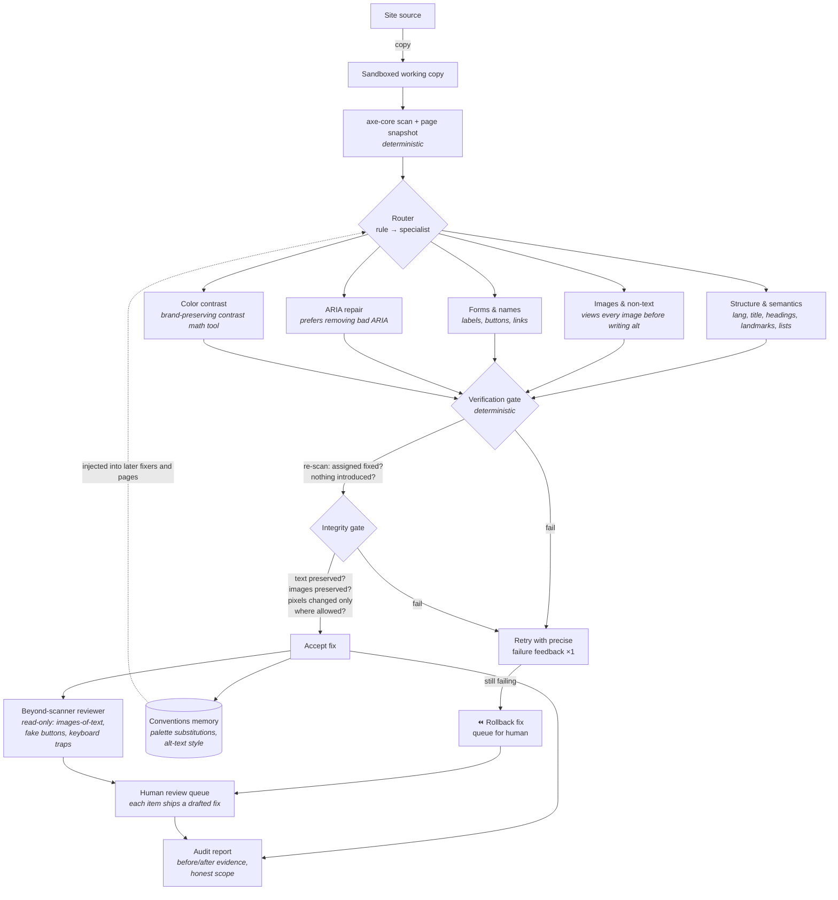

# StepFree - architecture

StepFree is a multi-agent workflow with a deterministic spine. Language models supply judgment; everything that can be computed is computed - scans, contrast math, screenshots, diffs, rollbacks. The model is never trusted to verify its own work.



## Components

| Component | Kind | Why it exists |
|---|---|---|
| **Scanner** (`src/lib/scan.mjs`) | deterministic | axe-core via Playwright; classifies WCAG A/AA vs best-practice tiers; instance-level diffing keyed by rule+selector |
| **Snapshot** (`src/lib/snapshot.mjs`) | deterministic | screenshots, visible text, element geometry, image inventory - the "before" evidence every fix is judged against |
| **Integrity gate** (`src/lib/integrity.mjs`) | deterministic | word-level text-loss (tolerance ≤2 non-stopword words), image-loss, pixel diff localized to allowed regions; research shows ~30% of unguarded LLM patches damage structure |
| **Contrast math** (`src/lib/contrast.mjs`) | deterministic | WCAG luminance math + closest-compliant-color search (hue/saturation preserved) - models guess colors, tools don't |
| **Specialists** (`src/agents/specialists.mjs` + `knowledge/*.md`) | agent | five fixers with per-domain expertise and only the tools each needs; ordered so structure lands before colors |
| **Harness** (`src/agents/harness.mjs`) | infra | Claude Agent SDK; path-guarded (no file access outside the working copy), no shell, no network; full trajectory capture |
| **Custom tools** (`src/agents/tools.mjs`) | infra | `scan_file`, `contrast_suggest`, `check_contrast`, `view_image`, `view_page`, `record_convention`, `flag_for_review` |
| **Conventions memory** | memory | site-wide decisions recorded once, injected into every later fixer - pages of one site get the SAME accessible palette and alt style |
| **Reviewer** (`knowledge/review.md`) | agent | read-only pass hunting what scanners can't see; output only via `flag_for_review` with drafted fixes |
| **Orchestrator** (`src/orchestrator.mjs`) | deterministic | the loop: route → fix → verify → retry → rollback → report; stage flags reproduce every changelog iteration |
| **Reporter** (`src/report/report.mjs`) | hybrid | numbers and evidence rendered deterministically from the ledger; an agent writes only the narrative prose |

## Safety posture (hackathon ground rules 4-5)

- All edits land in a **sandboxed working copy**; the input site is never touched. Deploying the fixed copy is the human's explicit action.
- Fixer agents have **no shell, no network**, and a permission guard denies any file operation outside the working copy.
- Judgment calls are **routed to a human review queue**, each with a drafted fix and a confidence level - the human approves, adjusts, or rejects.
- The report states scope honestly: automation covers roughly half of accessibility issues (Deque: 57% by volume); StepFree claims verified fixes only for the detectable layer.

## Stage flags = reproducible changelog

Every iteration in the improvement changelog is a config, not a git archaeology exercise:

```
node stepfree/src/cli.mjs fix fixtures/01-bakery --stage v1     # naive agent
node stepfree/src/cli.mjs fix fixtures/01-bakery --stage v2     # + verification loop
node stepfree/src/cli.mjs fix fixtures/01-bakery --stage v3     # + specialists, knowledge, tools
node stepfree/src/cli.mjs fix fixtures/01-bakery --stage v4     # + integrity guardrails & rollback
node stepfree/src/cli.mjs fix fixtures/01-bakery --stage final  # + memory, review lane, report
```
